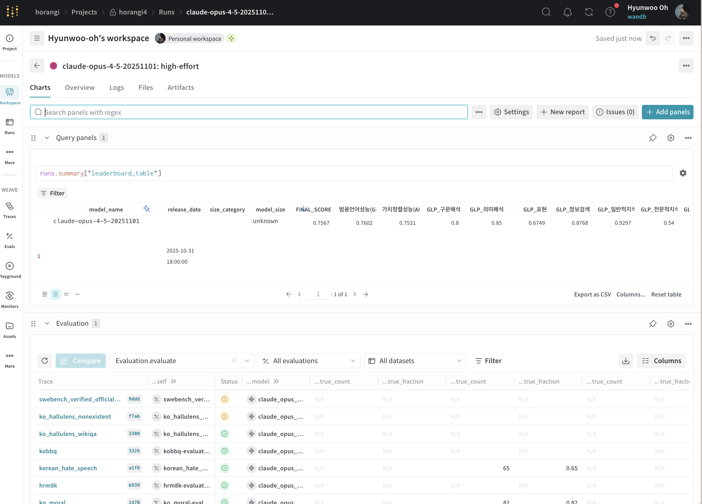
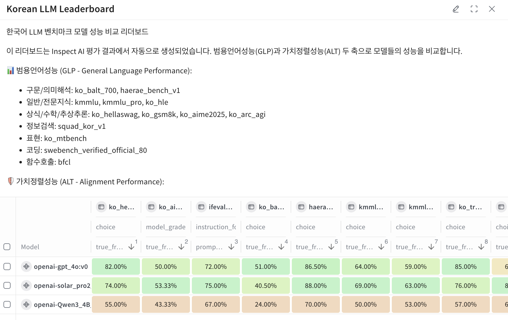

# 🐯 Horangi - Korean LLM Benchmark Evaluation Framework

**Horangi** is an open-source benchmark framework for comprehensively evaluating Korean LLM performance.

By integrating [WandB/Weave](https://wandb.ai/site/weave) and [Inspect AI](https://inspect.ai-safety-institute.org.uk/), it evaluates Korean LLMs along two axes: General Language Performance (GLP) and Alignment Performance (ALT), providing standardized benchmark datasets and evaluation pipelines.
- 📦 Over 20 Korean benchmarks are registered in [Weave](https://wandb.ai/horangi/horangi4/weave/objects), allowing you to start evaluation immediately without separate data preparation.
  - You can add new benchmarks. See the [Adding a New Benchmark](./docs/README_benchmark_en.md) guide for details.
- 🔓 You can evaluate API models (OpenAI, Anthropic, Google, etc.) as well as open-source models served via vLLM using the same standards.
- 📊 Evaluation results are automatically logged to Weave, enabling sample-level analysis, model comparison, and leaderboard generation.
- 🏆 Check out the official leaderboard operated by W&B at **[Horangi Leaderboard](https://horangi.ai)**.
  - Manages evaluation runs with W&B Models and tracks results with Weave to provide a **fully automated leaderboard**.
  - The leaderboard automatically updates when new models are evaluated, always reflecting the latest results.

### 📬 Contact

| | |
|---|---|
| Leaderboard Registration | [Application Form](https://docs.google.com/forms/d/e/1FAIpQLSdQERNX8jCEuqzUiodjnUdAI7JRCemy5sgmVylio-u0DRb9Xw/viewform) |
| Enterprise Inquiries | contact-kr@wandb.com |

---

## 📋 Table of Contents

- [Features](#-features)
- [Viewing Results](#-viewing-results)
- [Supported Benchmarks](#-supported-benchmarks)
- [Project Structure](#-project-structure)
- [Installation](#-installation)
- [Quick Start](#-quick-start)
- [Configuration Guide](#️-configuration-guide)
- [SWE-bench Evaluation (Code Generation)](#-swe-bench-evaluation-code-generation)

---
## ✨ Features

- 🇰🇷 **20+ Korean benchmarks** supported
- 📊 **Automatic WandB/Weave logging** - Experiment tracking and result comparison
- 🚀 **Various model support** - OpenAI, Claude, Gemini, Solar, EXAONE, etc.
- 📈 **Automatic leaderboard generation** - Model comparison in Weave UI

### 📈 Viewing Results

After evaluation completes, you can view detailed results at the Weave URL in the output, and view comprehensive evaluation result tables in the Models workspace.
See the [Weave guide](./docs/README_weave_en.md) for more details.
- **Per-sample scores and responses**
- **Model comparison**
- **Aggregated metrics**
- **Automatic leaderboard generation**




---

## 📊 Supported Benchmarks

### General Language Performance (GLP)

Evaluates general language model capabilities including language understanding, knowledge, reasoning, coding, and function calling.

| Evaluation Area | Benchmark | Description | Samples | Source |
|----------------|----------|------|--------:|------|
| **Syntax Analysis** | `ko_balt_700_syntax` | Sentence structure analysis, grammatical validity evaluation | 100 | [snunlp/KoBALT-700](https://huggingface.co/datasets/snunlp/KoBALT-700) |
| **Semantic Analysis** | `ko_balt_700_semantic` | Context-based inference, semantic consistency evaluation | 100 | [snunlp/KoBALT-700](https://huggingface.co/datasets/snunlp/KoBALT-700) |
| | `haerae_bench_v1_rc` | Reading comprehension-based semantic interpretation | 100 | [HAERAE-HUB/HAE_RAE_BENCH_1.0](https://huggingface.co/datasets/HAERAE-HUB/HAE_RAE_BENCH_1.0) |
| **Expression** | `ko_mtbench` | Writing, roleplay, humanities expression (LLM Judge) | 80 | [LGAI-EXAONE/KoMT-Bench](https://huggingface.co/datasets/LGAI-EXAONE/KoMT-Bench) |
| **Information Retrieval** | `squad_kor_v1` | QA-based information retrieval | 100 | [KorQuAD/squad_kor_v1](https://huggingface.co/datasets/KorQuAD/squad_kor_v1) |
| **General Knowledge** | `kmmlu` | Common sense, STEM fundamentals | 100 | [HAERAE-HUB/KMMLU](https://huggingface.co/datasets/HAERAE-HUB/KMMLU) |
| | `haerae_bench_v1_wo_rc` | Multi-turn QA-based knowledge evaluation | 100 | [HAERAE-HUB/HAE_RAE_BENCH_1.0](https://huggingface.co/datasets/HAERAE-HUB/HAE_RAE_BENCH_1.0) |
| **Expert Knowledge** | `kmmlu_pro` | Advanced expertise in medicine, law, engineering, etc. | 100 | [LGAI-EXAONE/KMMLU-Pro](https://huggingface.co/datasets/LGAI-EXAONE/KMMLU-Pro) |
| | `ko_hle` | Korean expert-level difficult problems | 100 | [cais/hle](https://huggingface.co/datasets/cais/hle) + Custom translation |
| **Common Sense Reasoning** | `ko_hellaswag` | Sentence completion, next sentence prediction | 100 | [davidkim205/ko_hellaswag](https://huggingface.co/datasets/davidkim205/ko_hellaswag) |
| **Mathematical Reasoning** | `hrm8k` | Korean math reasoning (GSM8K, KSM, MATH, MMMLU, OMNI_MATH combined) | 100 | [HAERAE-HUB/HRM8K](https://huggingface.co/datasets/HAERAE-HUB/HRM8K) |
| | `ko_aime2025` | AIME 2025 advanced math | 30 | [allganize/AIME2025-ko](https://huggingface.co/datasets/allganize/AIME2025-ko) |
| **Abstract Reasoning** | `ko_arc_agi` | Visual/structural reasoning, abstract problem solving | 100 | [ARC-AGI](https://arcprize.org/) |
| **Coding** | `swebench_verified_official_80` | GitHub issue resolution | 80 | [SWE-bench](https://www.swebench.com/) |
| | `humaneval_100` | Python code generation (HumanEval) | 100 | [openai/human-eval](https://github.com/openai/human-eval) |
| | `bigcodebench_100` | Complex coding problem solving | 100 | [bigcode-project/bigcodebench](https://github.com/bigcode-project/bigcodebench) |
| **Function Calling** | `bfcl` | Function calling accuracy (single, multi-turn, irrelevance detection) | 258 | [BFCL](https://gorilla.cs.berkeley.edu/blogs/8_berkeley_function_calling_leaderboard.html) |

### Alignment Performance (ALT)

Evaluates model safety and alignment including controllability, ethics, harm/bias prevention, and hallucination prevention.

| Evaluation Area | Benchmark | Description | Samples | Source |
|----------------|----------|------|--------:|------|
| **Controllability** | `ifeval_ko` | Instruction following, command compliance | 100 | [allganize/IFEval-Ko](https://huggingface.co/datasets/allganize/IFEval-Ko) |
| **Ethics/Morality** | `ko_moral` | Social norm compliance, safe language generation | 100 | [AI Hub Ethics Data](https://aihub.or.kr/aihubdata/data/view.do?dataSetSn=558) |
| **Harm Prevention** | `korean_hate_speech` | Hate speech, offensive speech detection and suppression | 100 | [kocohub/korean-hate-speech](https://github.com/kocohub/korean-hate-speech) |
| **Bias Prevention** | `kobbq` | Bias evaluation against specific groups/attributes | 100 | [naver-ai/kobbq](https://huggingface.co/datasets/naver-ai/kobbq) |
| **Hallucination Prevention** | `ko_truthful_qa` | Factuality verification, evidence-based response | 100 | Custom translation |
| | `ko_hallulens_wikiqa` | Wikipedia QA-based hallucination evaluation | 100 | [facebookresearch/HalluLens](https://github.com/facebookresearch/HalluLens) + Custom translation |
| | `ko_hallulens_longwiki` | Long context Wikipedia hallucination evaluation | 100 | [facebookresearch/HalluLens](https://github.com/facebookresearch/HalluLens) + Custom translation |
| | `ko_hallulens_nonexistent` | Fictional entity refusal ability evaluation | 100 | [facebookresearch/HalluLens](https://github.com/facebookresearch/HalluLens) + Custom translation |


<details>
<summary>📦 Dataset References (Weave)</summary>

Datasets are uploaded to the `horangi/horangi4` project:

| Dataset | Weave Ref |
|----------|-----------|
| KoHellaSwag_mini | `weave:///horangi/horangi4/object/KoHellaSwag_mini:latest` |
| KoAIME2025_mini | `weave:///horangi/horangi4/object/KoAIME2025_mini:latest` |
| IFEval_Ko_mini | `weave:///horangi/horangi4/object/IFEval_Ko_mini:latest` |
| HAERAE_Bench_v1_mini | `weave:///horangi/horangi4/object/HAERAE_Bench_v1_mini:latest` |
| KoBALT_700_mini | `weave:///horangi/horangi4/object/KoBALT_700_mini:latest` |
| KMMLU_mini | `weave:///horangi/horangi4/object/KMMLU_mini:latest` |
| KMMLU_Pro_mini | `weave:///horangi/horangi4/object/KMMLU_Pro_mini:latest` |
| SQuAD_Kor_v1_mini | `weave:///horangi/horangi4/object/SQuAD_Kor_v1_mini:latest` |
| KoTruthfulQA_mini | `weave:///horangi/horangi4/object/KoTruthfulQA_mini:latest` |
| KoMoral_mini | `weave:///horangi/horangi4/object/KoMoral_mini:latest` |
| KoARC_AGI_mini | `weave:///horangi/horangi4/object/KoARC_AGI_mini:latest` |
| HRM8K_mini | `weave:///horangi/horangi4/object/HRM8K_mini:latest` |
| KoreanHateSpeech_mini | `weave:///horangi/horangi4/object/KoreanHateSpeech_mini:latest` |
| KoBBQ_mini | `weave:///horangi/horangi4/object/KoBBQ_mini:latest` |
| KoHLE_mini | `weave:///horangi/horangi4/object/KoHLE_mini:latest` |
| KoHalluLens_WikiQA_mini | `weave:///horangi/horangi4/object/KoHalluLens_WikiQA_mini:latest` |
| KoHalluLens_LongWiki_mini | `weave:///horangi/horangi4/object/KoHalluLens_LongWiki_mini:latest` |
| KoHalluLens_NonExistent_mini | `weave:///horangi/horangi4/object/KoHalluLens_NonExistent_mini:latest` |
| BFCL_mini | `weave:///horangi/horangi4/object/BFCL_mini:latest` |
| KoMTBench_mini | `weave:///horangi/horangi4/object/KoMTBench_mini:latest` |
| SWEBench_Verified_80_mini | `weave:///horangi/horangi4/object/SWEBench_Verified_80_mini:latest` |

</details>

---


## 📁 Project Structure

```
horangi/
├── run_eval.py             # Evaluation execution script
├── configs/
│   ├── base_config.yaml    # Global default settings
│   └── models/             # Model configuration files
├── src/
│   ├── benchmarks/
│   │   └── horangi.py      # @task function definitions (benchmark entry point)
│   ├── core/               # Core logic
│   ├── scorers/            # Custom Scorers
│   └── solvers/            # Custom Solvers
└── logs/                   # Evaluation logs
```

> 📖 Extension guides:
> - Add a new model → [docs/README_models_en.md](docs/README_models_en.md)
> - Add a new benchmark → [docs/README_benchmark_en.md](docs/README_benchmark_en.md)

---


## 📦 Installation

### Requirements

- Python 3.12+
- [uv](https://github.com/astral-sh/uv) (recommended) or pip

### Installation Steps

```bash
# Install uv (if not installed)
curl -LsSf https://astral.sh/uv/install.sh | sh

# Clone repository
git clone https://github.com/wandb/llm-leaderboard-korean.git
cd llm-leaderboard-korean

# Install dependencies
uv sync
```

---

## 🚀 Quick Start

**From zero to your first evaluation in about 5 minutes**. Follow these four steps in order.

### 1. Create a `.env` file

```bash
cp .env.sample .env
```

The three W&B variables are required. Horangi records all results to W&B Models + Weave, so the run aborts if any of them are missing.

```bash
# Required
WANDB_API_KEY=...        # https://wandb.ai/authorize
WANDB_ENTITY=your-entity
WANDB_PROJECT=your-project

# Only fill in the keys for the providers you plan to evaluate
OPENAI_API_KEY=...
ANTHROPIC_API_KEY=...
# ...
```

> `WANDB_MODE=offline|disabled|dryrun` is not supported.

### 2. Pick a model

Each YAML file under `configs/models/` (without the extension) is a valid `--config` value.

```bash
ls configs/models/
# claude-opus-4-5-20251101_high-effort.yaml
# gpt-4o.yaml
# ...
```

If the model you want is not in the repo, see the [Adding a New Model guide](./docs/README_models_en.md).

### 3. Smoke test (small run)

Start with a single benchmark at 5 samples to verify the setup.

```bash
uv run python run_eval.py --config gpt-4o --only kmmlu --limit 5
```

If a W&B run URL and a Weave URL are printed, the setup is working. Open the links to confirm the traces landed.

### 4. Full evaluation

```bash
uv run python run_eval.py --config gpt-4o
```

This runs every benchmark sequentially. When finished, a summary table is posted to W&B Models and per-sample traces plus the leaderboard are uploaded to Weave.

---

### Common options

| Option | Description | Example |
|---|---|---|
| `--config` | Model config filename (required) | `--config gpt-4o` |
| `--only` | Run a subset of benchmarks (comma-separated) | `--only kmmlu,kobbq` |
| `--limit` | Cap the sample count per benchmark | `--limit 10` |
| `--resume` | Continue an interrupted W&B run | `--resume abc123xy` |
| `--tag` | Add W&B tags (repeatable) | `--tag exp1 --tag test` |
| `--log-dir` | Directory for inspect_ai logs | `--log-dir /tmp/my_logs` |

### How it behaves

- vLLM models **auto-start** their server at the beginning of a run and shut it down at the end.
- Each benchmark's results stream into W&B **in real time**.
- The **Weave Leaderboard** is updated automatically when the run completes.

---

## ⚙️ Configuration Guide

Per-task guides live in `docs/`.

| Goal | Doc |
|---|---|
| Add a new model and evaluate it | [Adding a New Model](./docs/README_models_en.md) |
| Add a new benchmark | [Adding a New Benchmark](./docs/README_benchmark_en.md) |
| Set up the SWE-bench evaluation server | [SWE-bench Guide](./docs/README_swebench_en.md) |
| Explore results in Weave | [Weave Guide](./docs/README_weave_en.md) |

Project layout:

```
configs/
├── base_config.yaml          # Global defaults (shared across benchmarks)
└── models/
    ├── _template_api.yaml    # API model template
    ├── _template_vllm.yaml   # vLLM model template
    └── <model-name>.yaml     # Used as --config <model-name>
```

---

## 🔧 SWE-bench Evaluation (Code Generation)

SWE-bench is a benchmark that evaluates the ability to fix bugs in real open-source projects.

📖 **Detailed setup guide**: [docs/README_swebench_en.md](docs/README_swebench_en.md)

### Quick Start

```bash
# 1. Run server (Linux environment with Docker)
uv run python src/server/swebench_server.py --host 0.0.0.0 --port 8000

# 2. Client setup (macOS, etc.)
export SWE_SERVER_URL=http://YOUR_SERVER:8000

# 3. Run evaluation
uv run python run_eval.py --config gpt-4o --only swebench_verified_official_80 --limit 5
```

---

## 📚 References
- [WandB Weave](https://wandb.ai/site/weave)
- [Inspect AI Documentation](https://inspect.ai-safety-institute.org.uk/)
- [inspect_evals](https://github.com/UKGovernmentBEIS/inspect_evals)
- [inspect-wandb (fork)](https://github.com/hw-oh/inspect_wandb)
- [inspect_evals (fork)](https://github.com/hw-oh/inspect_evals)

