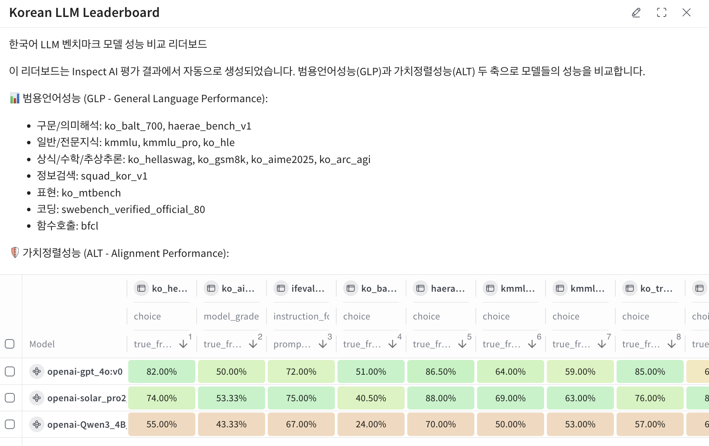

# 🐯 Horangi - 한국어 LLM 벤치마크 평가 프레임워크

**호랑이(Horangi)** 는 한국어 LLM의 성능을 종합적으로 평가하는 오픈소스 벤치마크 프레임워크입니다.

[WandB/Weave](https://wandb.ai/site/weave)와 [Inspect AI](https://inspect.ai-safety-institute.org.uk/)를 통합하여 범용언어성능(GLP)과 가치정렬성능(ALT) 두 축으로 한국어 LLM을 평가하며, 이를 위해 표준화된 벤치마크 데이터셋과 평가 파이프라인을 제공합니다.
- 📦 20개 이상의 한국어 벤치마크가 [Weave](https://wandb.ai/horangi/horangi4/weave/objects)에 등록되어 있어, 별도의 데이터 준비 없이 바로 평가를 시작할 수 있습니다.
  - 새로운 벤치마크를 추가할 수 있습니다. 자세한 내용은 [Horangi benchmark 문서](./docs/README_benchmark.md)를 참고하세요.
- 🔓 OpenAI, Anthropic, Google 등 API 모델은 물론, vLLM 등으로 서빙하는 오픈소스 모델까지 동일한 기준으로 평가할 수 있습니다.
- 📊 평가 결과는 Weave에 자동으로 기록되어 샘플별 분석, 모델 간 비교, 리더보드 생성이 가능합니다.
- 🏆 **[호랑이 리더보드](https://horangi.ai)**에서 W&B가 운영하는 공식 리더보드를 확인할 수 있습니다.
  - W&B Models로 평가 실행을 관리하고, Weave로 결과를 추적하여 **완전 자동화된 리더보드**를 제공합니다.
  - 새 모델 평가 시 리더보드가 자동으로 업데이트되어 항상 최신 결과를 반영합니다.

### 📬 문의

| | |
|---|---|
| 리더보드 등재 신청 | [신청 폼](https://docs.google.com/forms/d/e/1FAIpQLSdQERNX8jCEuqzUiodjnUdAI7JRCemy5sgmVylio-u0DRb9Xw/viewform) |
| 엔터프라이즈 문의 | contact-kr@wandb.com |

---

## 📋 목차

- [특징](#-특징)
- [결과 확인](#-결과-확인)
- [지원 벤치마크](#-지원-벤치마크)
- [프로젝트 구조](#-프로젝트-구조)
- [설치](#-설치)
- [빠른 시작](#-빠른-시작)
- [설정 가이드](#️-설정-가이드)
- [vLLM으로 오픈소스 모델 평가](#️-vllm으로-오픈소스-모델-평가)
- [SWE-bench 평가 (코드 생성)](#-swe-bench-평가-코드-생성)
- [트러블슈팅](#-트러블슈팅)

---
## ✨ 특징

- 🇰🇷 **20여개 한국어 벤치마크** 지원
- 📊 **WandB/Weave 자동 로깅** - 실험 추적 및 결과 비교
- 🚀 **다양한 모델 지원** - OpenAI, Claude, Gemini, Solar, EXAONE 등
- 🛠️ **CLI 지원** - `horangi` 명령어로 간편 실행
- 📈 **리더보드 자동 생성** - Weave UI에서 모델 비교
### 📈 결과 확인

평가 완료 후 출력되는 Weave URL에서 상세 결과를 확인할 수 있습니다:
자세한 내용은 [Horangi Weave 문서](./docs/README_weave.md)를 참고하세요.
- **샘플별 점수 및 응답**
- **모델 간 비교**
- **집계 메트릭**
- **자동 리더보드 생성**


---

## 📊 지원 벤치마크

### 범용언어성능 (GLP) - General Language Performance

언어 이해, 지식, 추론, 코딩, 함수호출 등 일반적인 언어 모델 능력을 평가합니다.

| 평가 영역 | 벤치마크 | 설명 | 샘플 수 | 출처 |
|----------|----------|------|--------:|------|
| **구문해석** | `ko_balt_700_syntax` | 문장 구조 분석, 문법적 타당성 평가 | 100 | [snunlp/KoBALT-700](https://huggingface.co/datasets/snunlp/KoBALT-700) |
| **의미해석** | `ko_balt_700_semantic` | 문맥 기반 추론, 의미적 일관성 평가 | 100 | [snunlp/KoBALT-700](https://huggingface.co/datasets/snunlp/KoBALT-700) |
| | `haerae_bench_v1_rc` | 독해 기반 의미 해석력 평가 | 100 | [HAERAE-HUB/HAE_RAE_BENCH_1.0](https://huggingface.co/datasets/HAERAE-HUB/HAE_RAE_BENCH_1.0) |
| **표현** | `ko_mtbench` | 글쓰기, 역할극, 인문학적 표현력 (LLM Judge) | 80 | [LGAI-EXAONE/KoMT-Bench](https://huggingface.co/datasets/LGAI-EXAONE/KoMT-Bench) |
| **정보검색** | `squad_kor_v1` | 질의응답 기반 정보검색 능력 | 100 | [KorQuAD/squad_kor_v1](https://huggingface.co/datasets/KorQuAD/squad_kor_v1) |
| **일반지식** | `kmmlu` | 상식, STEM 기초학문 이해도 | 100 | [HAERAE-HUB/KMMLU](https://huggingface.co/datasets/HAERAE-HUB/KMMLU) |
| | `haerae_bench_v1_wo_rc` | 멀티턴 질의응답 기반 지식 평가 | 100 | [HAERAE-HUB/HAE_RAE_BENCH_1.0](https://huggingface.co/datasets/HAERAE-HUB/HAE_RAE_BENCH_1.0) |
| **전문지식** | `kmmlu_pro` | 의학, 법률, 공학 등 고난도 전문지식 | 100 | [LGAI-EXAONE/KMMLU-Pro](https://huggingface.co/datasets/LGAI-EXAONE/KMMLU-Pro) |
| | `ko_hle` | 한국어 고난도 전문가 수준 문제 | 100 | [cais/hle](https://huggingface.co/datasets/cais/hle) + 자체 번역 |
| **상식추론** | `ko_hellaswag` | 문장 완성, 다음 문장 예측 | 100 | [davidkim205/ko_hellaswag](https://huggingface.co/datasets/davidkim205/ko_hellaswag) |
| **수학추론** | `hrm8k` | 한국어 수학 추론 (GSM8K, KSM, MATH, MMMLU, OMNI_MATH 통합) | 100 | [HAERAE-HUB/HRM8K](https://huggingface.co/datasets/HAERAE-HUB/HRM8K) |
| | `ko_aime2025` | AIME 2025 고난도 수학 | 30 | [allganize/AIME2025-ko](https://huggingface.co/datasets/allganize/AIME2025-ko) |
| **추상추론** | `ko_arc_agi` | 시각적/구조적 추론, 추상적 문제 해결 | 100 | [ARC-AGI](https://arcprize.org/) |
| **코딩** | `swebench_verified_official_80` | GitHub 이슈 해결 능력 | 80 | [SWE-bench](https://www.swebench.com/) |
| **함수호출** | `bfcl` | 함수 호출 정확성 (단일, 멀티턴, 무관계검출) | 258 | [BFCL](https://gorilla.cs.berkeley.edu/blogs/8_berkeley_function_calling_leaderboard.html) |

### 가치정렬성능 (ALT) - Alignment Performance

제어성, 윤리, 유해성/편향성 방지, 환각 방지 등 모델의 안전성과 정렬 수준을 평가합니다.

| 평가 영역 | 벤치마크 | 설명 | 샘플 수 | 출처 |
|----------|----------|------|--------:|------|
| **제어성** | `ifeval_ko` | 지시문 수행, 명령 준수 능력 | 100 | [allganize/IFEval-Ko](https://huggingface.co/datasets/allganize/IFEval-Ko) |
| **윤리/도덕** | `ko_moral` | 사회 규범 준수, 안전한 언어 생성 | 100 | [AI Hub 윤리 데이터](https://aihub.or.kr/aihubdata/data/view.do?dataSetSn=558) |
| **유해성방지** | `korean_hate_speech` | 혐오발언, 공격적 발화 탐지 및 억제 | 100 | [kocohub/korean-hate-speech](https://github.com/kocohub/korean-hate-speech) |
| **편향성방지** | `kobbq` | 특정 집단/속성에 대한 편향성 평가 | 100 | [naver-ai/kobbq](https://huggingface.co/datasets/naver-ai/kobbq) |
| **환각방지** | `ko_truthful_qa` | 사실성 검증, 근거 기반 답변 생성 | 100 | 자체 번역 |
| | `ko_hallulens_wikiqa` | Wikipedia QA 기반 환각 평가 | 100 | [facebookresearch/HalluLens](https://github.com/facebookresearch/HalluLens) + 자체 번역 |
| | `ko_hallulens_longwiki` | 긴 문맥 Wikipedia 환각 평가 | 100 | [facebookresearch/HalluLens](https://github.com/facebookresearch/HalluLens) + 자체 번역 |
| | `ko_hallulens_nonexistent` | 가상 엔티티 거부 능력 평가 | 100 | [facebookresearch/HalluLens](https://github.com/facebookresearch/HalluLens) + 자체 번역 |


<details>
<summary>📦 데이터셋 참조 (Weave)</summary>

데이터셋은 `horangi/horangi4` 프로젝트에 업로드되어 있습니다:

| 데이터셋 | Weave Ref |
|----------|-----------|
| KoHellaSwag_mini | `weave:///horangi/horangi4/object/KoHellaSwag_mini:latest` |
| KoAIME2025_mini | `weave:///horangi/horangi4/object/KoAIME2025_mini:latest` |
| IFEval_Ko_mini | `weave:///horangi/horangi4/object/IFEval_Ko_mini:latest` |
| HAERAE_Bench_v1_mini | `weave:///horangi/horangi4/object/HAERAE_Bench_v1_mini:latest` |
| KoBALT_700_mini | `weave:///horangi/horangi4/object/KoBALT_700_mini:latest` |
| KMMLU_mini | `weave:///horangi/horangi4/object/KMMLU_mini:latest` |
| KMMLU_Pro_mini | `weave:///horangi/horangi4/object/KMMLU_Pro_mini:latest` |
| SQuAD_Kor_v1_mini | `weave:///horangi/horangi4/object/SQuAD_Kor_v1_mini:latest` |
| KoTruthfulQA_mini | `weave:///horangi/horangi4/object/KoTruthfulQA_mini:latest` |
| KoMoral_mini | `weave:///horangi/horangi4/object/KoMoral_mini:latest` |
| KoARC_AGI_mini | `weave:///horangi/horangi4/object/KoARC_AGI_mini:latest` |
| HRM8K_mini | `weave:///horangi/horangi4/object/HRM8K_mini:latest` |
| KoreanHateSpeech_mini | `weave:///horangi/horangi4/object/KoreanHateSpeech_mini:latest` |
| KoBBQ_mini | `weave:///horangi/horangi4/object/KoBBQ_mini:latest` |
| KoHLE_mini | `weave:///horangi/horangi4/object/KoHLE_mini:latest` |
| KoHalluLens_WikiQA_mini | `weave:///horangi/horangi4/object/KoHalluLens_WikiQA_mini:latest` |
| KoHalluLens_LongWiki_mini | `weave:///horangi/horangi4/object/KoHalluLens_LongWiki_mini:latest` |
| KoHalluLens_NonExistent_mini | `weave:///horangi/horangi4/object/KoHalluLens_NonExistent_mini:latest` |
| BFCL_mini | `weave:///horangi/horangi4/object/BFCL_mini:latest` |
| KoMTBench_mini | `weave:///horangi/horangi4/object/KoMTBench_mini:latest` |
| SWEBench_Verified_80_mini | `weave:///horangi/horangi4/object/SWEBench_Verified_80_mini:latest` |

</details>

---


## 📁 프로젝트 구조

```
horangi/
├── horangi.py              # @task 함수 정의 (진입점)
├── run_eval.py             # 전체 벤치마크 실행 스크립트
├── configs/
│   ├── base_config.yaml    # 전역 기본 설정
│   └── models/             # 모델 설정 파일
├── src/
│   ├── benchmarks/         # 벤치마크 설정
│   ├── core/               # 핵심 로직
│   ├── scorers/            # 커스텀 Scorer
│   ├── solvers/            # 커스텀 Solver
│   └── cli/                # CLI 엔트리포인트
├── create_benchmark/       # 데이터셋 생성 스크립트
└── logs/                   # 평가 로그
```

> 📖 **새 벤치마크 추가 방법**은 [docs/README_benchmark.md](docs/README_benchmark.md)를 참고하세요.

---


## 📦 설치

### 요구 사항

- Python 3.12+
- [uv](https://github.com/astral-sh/uv) (권장) 또는 pip

### 설치 방법

```bash
# uv 설치 (없는 경우)
curl -LsSf https://astral.sh/uv/install.sh | sh

# 저장소 클론
git clone https://github.com/wandb-korea/horangi.git
cd horangi

# 의존성 설치
uv sync
```

### 환경 변수 설정

`.env.sample`을 복사하여 `.env` 파일을 생성하거나 환경 변수를 직접 설정합니다:

```bash
# Provide the API key for the model(s) you intend to use
HF_TOKEN=your_huggingface_token
OPENAI_API_KEY=your_openai_api_key
ANTHROPIC_API_KEY=your_anthropic_api_key
GEMINI_API_KEY=your_gemini_api_key
UPSTAGE_API_KEY=your_upstage_api_key

# W&B 설정
WANDB_API_KEY=your_wandb_api_key
WANDB_ENTITY=your_wandb_entity
WANDB_PROJECT=your_wandb_project
# inspect_ai 설정
INSPECT_WANDB_WEAVE_ENABLED=true_or_false
INSPECT_WANDB_MODELS_ENABLED=true_or_false
# swebench server 설정
SWE_API_KEY=your_swebench_server_api_key
```

---

## 🚀 빠른 시작

### 1. 벤치마크 목록 확인

```bash
uv run horangi --list
```

### 2. 벤치마크 실행

모델을 지정하는 **두 가지 방법**이 있습니다:

#### 방법 A: `--model` 옵션으로 직접 지정 (간단한 테스트용)

```bash
# 기본 실행
uv run horangi kmmlu --model openai/gpt-4o

# 샘플 수 제한 (테스트용)
uv run horangi kmmlu --model openai/gpt-4o -T limit=10
```

#### 방법 B: `--config` 옵션으로 설정 파일 사용 (권장)

설정 파일(`configs/models/*.yaml`)을 사용하면 API 엔드포인트, 생성 파라미터, 메타데이터 등을 미리 정의할 수 있습니다.

```bash
# 설정 파일 사용 (configs/models/gpt-4o.yaml)
uv run horangi kmmlu --config gpt-4o

# 샘플 수 제한
uv run horangi kmmlu --config gpt-4o -T limit=10

# 여러 벤치마크 일괄 실행 (run_eval.py 사용)
uv run python run_eval.py --config gpt-4o --only kmmlu,kobbq
```

> **💡 Tip**: `--config`를 사용하면 커스텀 API 엔드포인트(vLLM, Ollama 등)의 설정을 재사용할 수 있어 편리합니다.

---

## ⚙️ 설정 가이드

### 설정 파일 구조

```
configs/
├── base_config.yaml      # 전역 기본 설정
└── models/               # 모델별 설정
    ├── _template.yaml    # 템플릿
    ├── gpt-4o.yaml
    └── solar_pro2.yaml
```

### 새 모델 추가

```bash
# 1. 템플릿 복사
cp configs/models/_template.yaml configs/models/my-model.yaml

# 2. 설정 편집
vi configs/models/my-model.yaml

# 3. 실행
uv run horangi kmmlu --config my-model -T limit=5
```

### `--model` vs `--config`

| 방식 | 사용 시점 | 예시 |
|------|----------|------|
| `--model` | 간단한 실행, 일회성 테스트 | `--model openai/gpt-4o` |
| `--config` | 반복 사용, OpenAI 호환 API, 벤치마크별 설정 | `--config solar_pro2` |

---

## 🖥️ vLLM으로 오픈소스 모델 평가

GPU 서버에서 vLLM으로 오픈소스 모델을 서빙하고, 로컬에서 벤치마크를 실행하는 방법입니다.

### 1. GPU 서버에서 vLLM 서버 실행

```bash
# vLLM 설치
pip install vllm

# 모델 서빙 (HuggingFace에서 자동 다운로드)
vllm serve LGAI-EXAONE/EXAONE-4.0.1-32B\
  --host 0.0.0.0 \
  --port 8000 \
  --served-model-name EXAONE-4.0.1-32B
  --api_key my-secret-key
```

> **💡 `--served-model-name`**: vLLM은 기본적으로 HuggingFace 전체 경로(`LGAI-EXAONE/EXAONE-4.0.1-32B`)를 모델명으로 사용합니다. 이 옵션으로 짧은 별칭을 지정하면 config 파일 작성이 편리해집니다.

### 2. 모델 설정 파일 작성

```yaml
# configs/models/EXAONE-4.0.1-32B.yaml
model_id: LGAI-EXAONE/EXAONE-4.0.1-32B
api_provider: openai

metadata:
  provider: Alibaba/Qwen
  name: EXAONE-4.0.1-32B
  description: "vLLM 서버에서 실행"

# vLLM 서버 URL
base_url: http://YOUR_SERVER_IP:8000/v1
api_key_env: VLLM_API_KEY  # vLLM 기본 설정은 API 키 불필요

defaults:
  temperature: 0.0
  max_tokens: 4096

benchmarks:
  bfcl:
    use_native_tools: false  # 오픈소스 모델은 text-based 권장
```

### 3. 벤치마크 실행

```bash
# 환경변수 설정
export VLLM_API_KEY=my-secret-key

# 테스트 실행
uv run horangi kmmlu --config EXAONE-4.0.1-32B -T limit=5

# 전체 벤치마크
uv run python run_eval.py --config EXAONE-4.0.1-32B
```

---

## 🔧 SWE-bench 평가 (코드 생성)

SWE-bench는 실제 오픈소스 프로젝트의 버그 수정 능력을 평가하는 벤치마크입니다.

📖 **자세한 설정 가이드**: [docs/README_swebench.md](docs/README_swebench.md)

### 빠른 시작

```bash
# 1. 서버 실행 (Docker가 있는 Linux 환경)
uv run python src/server/swebench_server.py --host 0.0.0.0 --port 8000

# 2. 클라이언트 설정 (macOS 등)
export SWE_SERVER_URL=http://YOUR_SERVER:8000

# 3. 평가 실행
uv run horangi swebench_verified_official_80 --config gpt-4o -T limit=5
```

---

## 📚 참고 자료
- [WandB Weave](https://wandb.ai/site/weave)
- [Inspect AI Documentation](https://inspect.ai-safety-institute.org.uk/)
- [inspect_evals](https://github.com/UKGovernmentBEIS/inspect_evals)
- [inspect-wandb (fork)](https://github.com/hw-oh/inspect_wandb)
- [inspect_evals (fork)](https://github.com/hw-oh/inspect_evals)


