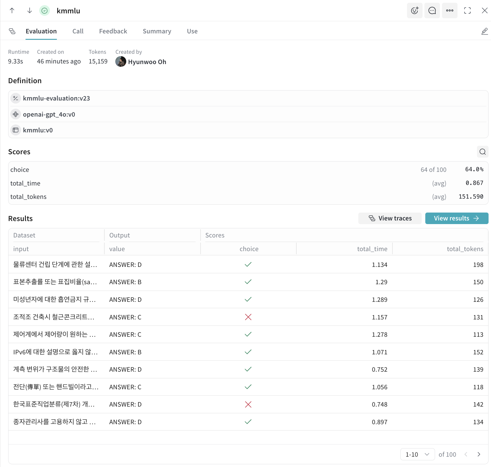
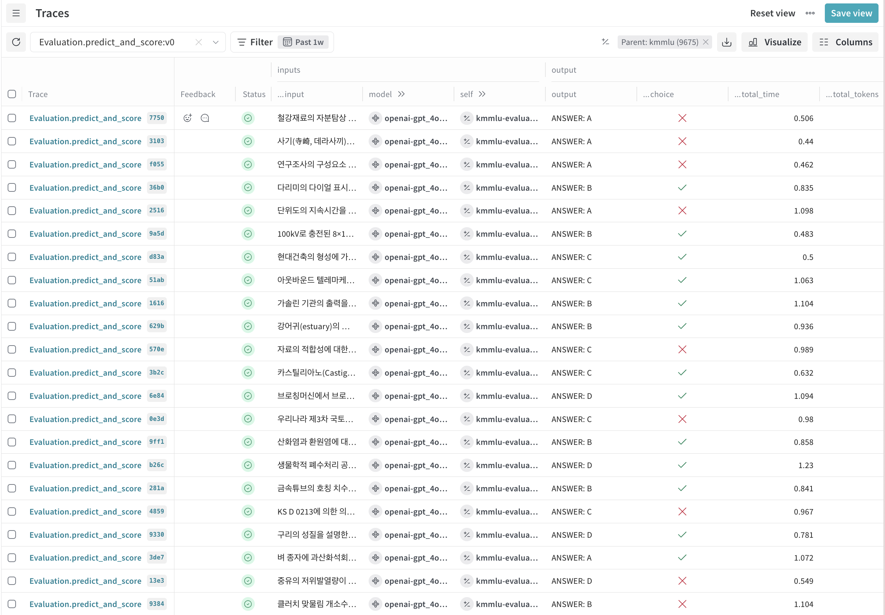
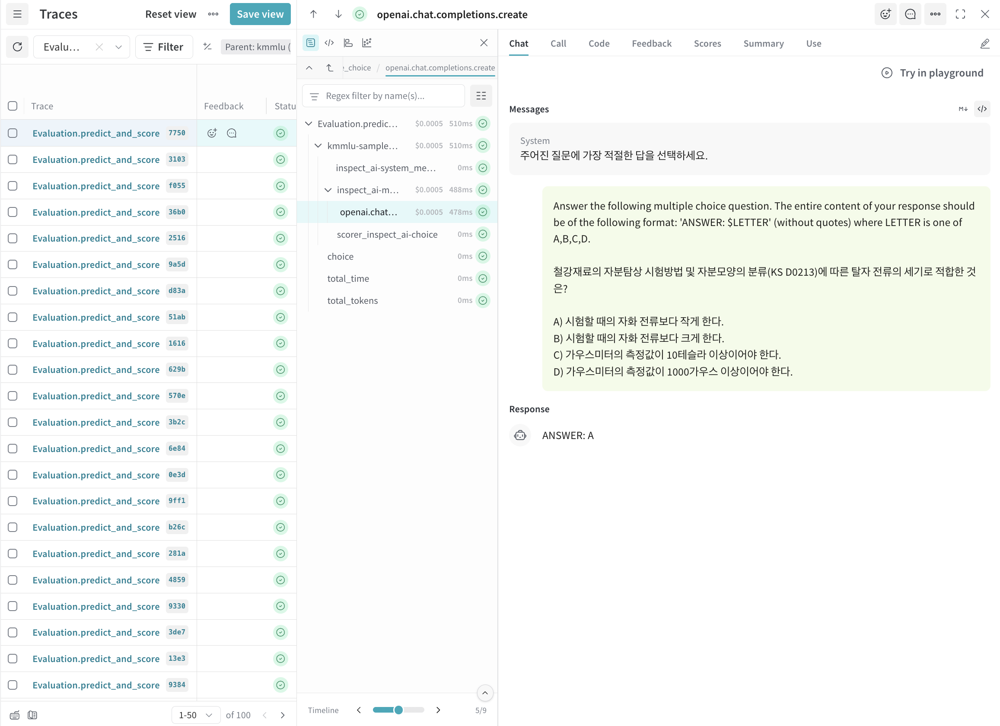

# 🔍 Weave Integration Guide

This document explains how to use [WandB Weave](https://wandb.ai/site/weave) in the Horangi project.

---

## 📖 What is Weave?

**Weave** is an LLM application observability and evaluation tool provided by Weights & Biases.

### Key Features

| Feature | Description |
|------|------|
| **Traces** | Automatically tracks LLM call inputs/outputs, token usage, latency, etc. |
| **Evaluations** | Stores and compares benchmark evaluation results in structured format |
| **Datasets** | Stores evaluation datasets with version control |
| **Leaderboard** | Creates leaderboards to compare evaluation results across multiple models |


---

## 🔗 Weave Project Structure

When you run Horangi evaluations, the following Weave objects are created:

```
Weave Project (<entity>/<project>)
├── Objects/
│   ├── Datasets (Benchmark datasets)
│   │   ├── KoHellaSwag_mini
│   │   ├── KMMLU_mini
│   │   └── ...
│   └── Leaderboards
│       └── Korean-LLM-Leaderboard
├── Evaluations/
│   ├── ko_hellaswag-evaluation
│   ├── kmmlu-evaluation
│   └── ...
└── Traces/
    └── (Detailed execution records for each evaluation)
```

---

## 📊 Evaluations

> 📚 **Official Documentation**: [Evaluations Overview](https://docs.wandb.ai/weave/guides/core-types/evaluations)

### Overview

When you run a benchmark, each evaluation is saved as an **Evaluation** object. An Evaluation contains the following information:

- **Model**: The evaluated model name
- **Dataset**: The dataset used
- **Scores**: Aggregated scores per scorer
- **Samples**: Input/output/scores for individual samples

### Viewing Results After Evaluation

```bash
uv run horangi kmmlu --config gpt-4o
```

After completion, a Weave URL is output to the terminal:

```
🔗 Weave Eval example: https://wandb.ai/horangi/horangi4/r/call/019b2a28-...
```



### Evaluation UI Components

| Tab | Description |
|----|------|
| **Evaluation** | Evaluation summary and per-sample results table |
| **Call** | Call information for the evaluation run |
| **Feedback** | User feedback (if any) |
| **Summary** | Evaluation metadata summary |
| **Use** | How to reference in code |

### Screen Components

**Definition**: Basic evaluation information
- `kmmlu-evaluation:v23` - Evaluation object version
- `openai-gpt_4o:v0` - Evaluated model
- `kmmlu:v0` - Dataset used

**Scores**: Aggregated scores
- `choice` - Accuracy (e.g., 64 of 100 → 64.0%)
- `total_time` - Average response time
- `total_tokens` - Average token usage

**Results**: Per-sample results table
- `input` - Question content
- `Output` - Model response (e.g., ANSWER: D)
- `choice` - Correct/incorrect (✓/✗)
- `total_time` - Response time
- `total_tokens` - Token count

---

## 🔎 Traces

> 📚 **Official Documentation**: [Tracing Quickstart](https://docs.wandb.ai/weave/guides/tracking/tracing)

### Overview

**Traces** record all LLM calls during evaluation on a per-sample basis.

Each Trace includes:
- **Input/Output**: Prompts sent to the model and generated responses
- **Scores**: Correctness and detailed scores from Scorers
- **Performance Metrics**: Response time, token usage

This enables **error analysis**, **response time bottleneck identification**, **token cost optimization**, etc.

Click the `View traces` button in the Evaluations screen to see traces recorded for that evaluation.

### Traces Table Columns

| Column | Description |
|------|------|
| **Trace** | Trace name (`Evaluation.predict_and_score` + hash) |
| **Feedback** | User feedback (if any) |
| **Status** | Execution status (✓ success) |
| **...input** | Input question content |
| **model** | Model used (e.g., `openai-gpt_4o...`) |
| **self** | Linked Evaluation (e.g., `kmmlu-evalua...`) |
| **output** | Model response (e.g., `ANSWER: A`) |
| **...choice** | Correct/incorrect (✓/✗) |
| **...total_time** | Response time (seconds) |
| **...total_tokens** | Tokens used |




### Trace Details

Click an individual Trace to see the full call chain:



---

## 🏆 Leaderboard

> 📚 **Official Documentation**: [Leaderboard Quickstart](https://docs.wandb.ai/weave/cookbooks/leaderboard_quickstart)

### Overview

**Leaderboard** is a table that lets you compare evaluation results across multiple models at a glance.


---

## ⚙️ Weave Configuration

### Environment Variables

The following environment variables are required for Weave integration:

```bash
# .env file
WANDB_API_KEY=your_wandb_api_key
WANDB_ENTITY=horangi          # or your own entity
WANDB_PROJECT=horangi4        # or your own project
```

---

## 🔗 Useful Links

### Official Documentation
- [Weave Documentation](https://docs.wandb.ai/weave)
- [Weave Cookbooks](https://docs.wandb.ai/weave/cookbooks) - Various usage examples
- [Evaluations Guide](https://docs.wandb.ai/weave/guides/core-types/evaluations)
- [Tracing Guide](https://docs.wandb.ai/weave/guides/tracking/tracing)
- [Leaderboard Quickstart](https://docs.wandb.ai/weave/cookbooks/leaderboard_quickstart)
- [Horangi Leaderboard](https://horangi.ai)

