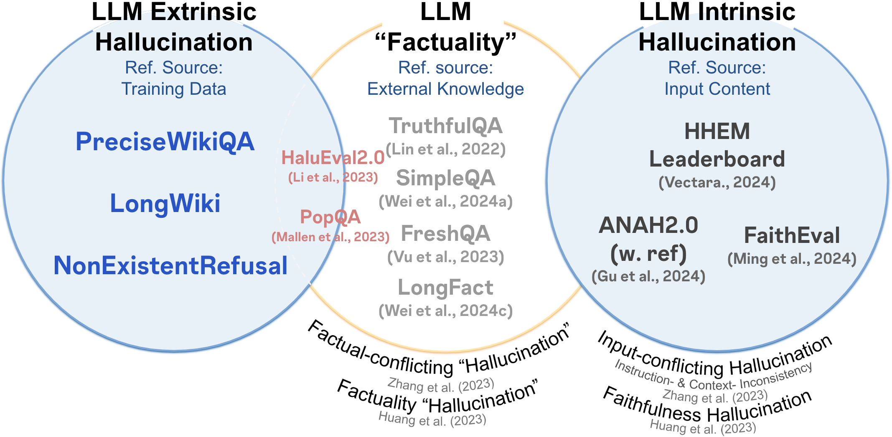
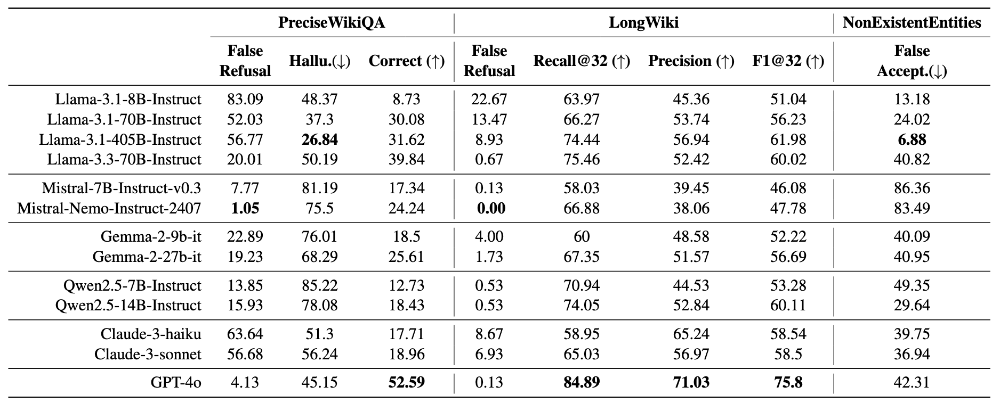

# HalluLens: LLM Hallucination Benchmark
*Yejin Bang, Ziwei Ji, Alan Schelten, Anthony Hartshorn, Tara Fowler, Cheng Zhang, Nicola Cancedda, Pascale Fung*

[](https://arxiv.org/pdf/2504.17550)

This repo is the code release accompanying our release of [HalluLens: LLM Hallucination Benchmark](https://arxiv.org/abs/2504.17550). 

This code **dynamically** generates evaluation data to test textual hallucination in LLMs so that the test set is not leaked and the evaluation not gameable. This will allow researchers and developers to evaluate any existing and also future LLMs that will be released for textual hallucination. 

## LLM Hallucination
 LLM Hallucination is defined "as a model behavior where its output is found to be inconsistent with either *its training corpus* or the *input context*." Whereas the oracle for factuality can be difficult to define and even controversial at times, an oracle for hallucination can be defined internally with respect to the model.

<div align="center">
  

  **LLM Hallucination Taxonomy**
</div>


 #### Categories of LLM Hallucination

 * **Extrinsic Hallucination**: A generation which is not consistent with the *training data*. It can neither be
supported nor refuted by the input context. Such hallucinations often arise when models generate novel
content (i.e., free-form text based on task instruction) or attempt to fill knowledge gaps. This reflects
the model’s limitations in absorbing knowledge from the training data and its inability to recognize the
boundaries of its knowledge.
 * **Intrinsic Hallucination**: A generation which is not consistent with the *input context*. When models fail to
understand the input context correctly, they generate content that contradicts the input query or is not
supported by the original input query. This reflects the model’s inability to maintain consistency at
inference-time.

## Extrinsic Hallucination Benchmark
1. ### **PreciseWikiQA**:
   to evaluate the model’s hallucination level on *short and fact-seeking queries* based on the knowledge from training data. The questions are bounded to training data.

3. **LongWiki**: to evaluate the model’s hallucination level on *long-form content generation* based on the knowledge from training data

4. **NonExistentRefusal**: to evaluate the model’s likelihood of generating hallucinated information *when prompted with knowledge beyond its training data* such as non-existent instances that sound natural. We create nonexistent entity names in various domains such as animal, plant, business, brand that sound natural. It consists two sub-tasks: (i) MixedEntities (ii) GeneratedEntities

<div align="center">
  

  **Table 1:** Extrinsic hallucination evaluation results on three HalluLens tasks – PreciseWikiQA, LongWiki, and
NonExistentEntities – in percentage (average of three trials of evaluation). Hallu refers to Hallucinated when not refused, a ratio of answers include incorrect answers when it did not refuse. Correct refers to total correct answer rate, where refusal is considered to be incorrect. False Accept. refers to false acceptance rate, likelihood of model fails to prevent from hallucination on nonexistent entities.
</div>

## 🛠️ Installation
```
git clone https://github.com/facebookresearch/HalluLens.git
cd HalluLens

conda create --name hallulens python==3.12 #3.8.17
conda activate hallulens
pip install -r requirements.txt
```

### 🛢️ Getting ready with data 
We provide script to download all data needed for all three tasks. This code will download all the data that you need for HalluLens. All data will be downloded under the ``/data`` folder. 

#### ⚠️Notice
Wikipedia dump is large (~16GB), so please make sure you have enough space. And it may not be able to download from this codes..

```
bash scripts/download_data.sh
```
It include as follow:
- [Wikirank](https://wikirank-2024.di.unimi.it/)
- [GoodWiki](https://huggingface.co/datasets/euirim/goodwiki)
- Processed Wikipedia dump (from [FactScore](https://arxiv.org/abs/2305.14251))
- [ITIS taxonomy](https://www.itis.gov/)
- [250k Medicines Usage, Side Effects and Substitutes](https://www.kaggle.com/datasets/shudhanshusingh/250k-medicines-usage-side-effects-and-substitutes)

### Getting ready with LLM inference.

Set up your own inference method and replace it in function custom_api ``utils/lm.py``

* For our experiments, we used model checkpoints from Huggingface and hosted through vLLM package -- which you can directly use the default setup call_vllm_api. Refer to [VLLM blog](https://blog.vllm.ai/2024/07/23/llama31.html) for details. For example:

``` 
vllm serve meta-llama/Llama-3.1-405B-Instruct-FP8 --tensor-parallel-size 8
```
<!-- vllm serve meta-llama/-Llama-3.1-8B-Instruct --dtype=half --max-model-len 10000 -->

* We have set the test set prompt generators and LLM evaluator to be same as our experiment set ups. We recommend to use same set up to replicate the results.


## 🔬 Run Evaluation  

### Overview
All scripts for each task is in scripts. There are mainly three steps for each tasks:

1. `do_generate_prompt` : It generates test prompt for each task under the folder of data
2. `do_inference`: This argument enables the inference of your model
3. `do_eval`: Evalaution for each tasks.

By default, all three steps will be conducted when you run the scripts below. If you want the separate step, you can comment out the step you want to skip. 

### Task 1: PreciseWikiQA
> ``tasks/shortform/precise_wikiqa.py``
```
bash scripts/task1_precisewikiqa.sh
```

### Task 2: LongWiki
> ``tasks/longwiki/longwiki_main.py``
```
bash scripts/task2_longwiki.sh
```

### Task 3: NonExistentRefusal
There are two subtasks:

(1) MixedEntities 
> ``tasks/refusal_test/nonsense_mixed_entities.py``
```
bash scripts/task3-1_mixedentities.sh
```
(2) GeneratedEntities
> ``tasks/refusal_test/round_robin_nonsene_name.py``
#### Prerequisite: set your keys for BRAVE_API_KEY and OPENAI_KEY.
* Note: We used [Brave Search API](https://brave.com/search/api/) for search function. You can either use it with your own access key or your preferred API.

```
bash scripts/task3-2_generatedentities.sh
```


## 📜 Citation
```
@article{bang2025hallulens,
      title={HalluLens: LLM Hallucination Benchmark}, 
      author={Yejin Bang and Ziwei Ji and Alan Schelten and Anthony Hartshorn and Tara Fowler and Cheng Zhang and Nicola Cancedda and Pascale Fung},
      year={2025},
      eprint={2504.17550},
      archivePrefix={arXiv},
      primaryClass={cs.CL},
      url={https://arxiv.org/abs/2504.17550}, 
}
```

## Liscence.
The majority of HalluLens is licensed under CC-BY-NC, however portions of the project are available under separate license terms: https://github.com/shmsw25/FActScore is licensed under the MIT license; VeriScore is licensed under the Apache 2.0 license.
